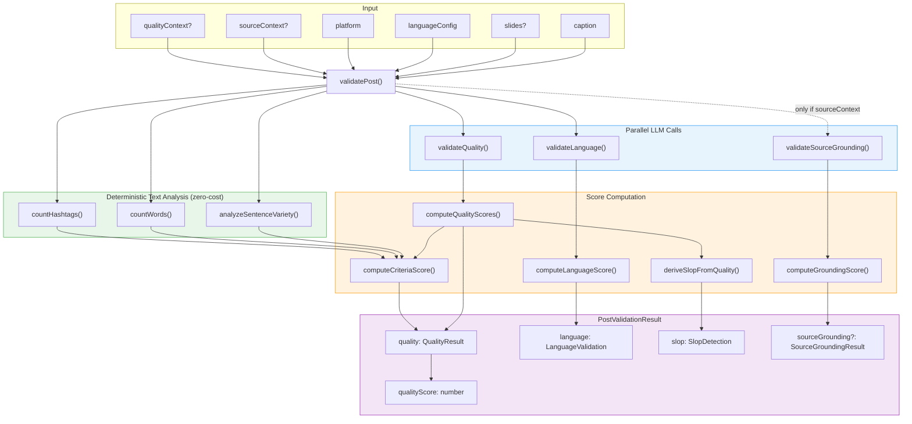
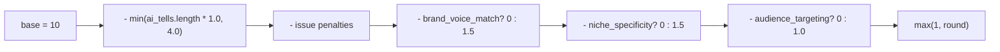
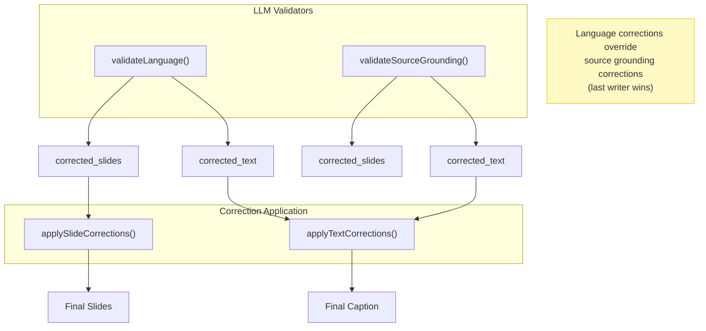

# Post Validation & Scoring Pipeline

## Overview

```
validatePost(caption, slides?, languageConfig, platform, sourceContext?, qualityContext?)
```

Three LLM validators run **in parallel**, followed by deterministic scoring and correction.

---

## Architecture



---

## Score Formulas

### Quality Score Average (final score)

```
quality_score_avg = (human_score + hook_score + cta_score + criteria_score) / 4
```

### Human Score (1-10)



| Issue Type       | Penalty |
| ---------------- | ------- |
| `no_personality` | -1.5    |
| `off_brand`      | -1.5    |
| `too_polished`   | -1.0    |
| `wrong_audience` | -1.0    |
| `filler_content` | -0.75   |
| `repetitive`     | -0.75   |

AI tell penalty: `-1.0 per tell`, capped at `-4.0`.

### Hook Score (1-10)

| Verdict        | Base Score |
| -------------- | ---------- |
| `stops_scroll` | 10         |
| `clear_value`  | 8          |
| `generic`      | 5          |
| `buries_lead`  | 3          |
| `no_hook`      | 1          |

Additional penalties: `weak_hook` (-1), `buried_lead` (-1).

### CTA Score (1-10)

| Verdict            | Base Score |
| ------------------ | ---------- |
| `natural_specific` | 10         |
| `clear_relevant`   | 8          |
| `generic`          | 5          |
| `weak_mismatched`  | 3          |
| `missing`          | 1          |

**Exception**: If `cta_verdict = 'missing'` AND `structure_used` is `MYTH-BREAKER` or `CONFESSION` -> score = **10** (these structures don't need CTAs).

Additional penalty: `generic_cta` (-1).

### Criteria Score (1-10)

```
base = 10
- structure_is_predictable?       -1.5
- !sentenceVariety.passes?        -1.0
- !formality_consistent?          -1.5
- source_fidelity_ok === false?   -1.5
- health_compliant === false?     -2.0
- word count out of range?        -0.75
- hashtags over limit?            -0.5
```

### Language Score (1-10)

| Issue Type     | Weight |
| -------------- | ------ |
| `mixed_script` | -2.0   |
| `grammar`      | -1.5   |
| `calque`       | -1.5   |
| `anglicism`    | -1.0   |
| `formality`    | -1.0   |
| `vocabulary`   | -1.0   |
| `register`     | -0.75  |

If corrections were auto-applied: **score = 10, passes = true**.
Otherwise: `passes = (score >= 8) AND (issues.length === 0)`.

### Source Grounding Score (1-10)

```
If no flagged claims: score = 10, grounded = true

Otherwise:
  score = 10 * (grounded_count + 0.5 * partial_count) / total_claims
  grounded = (score === 10)
```

---

## Slop Detection

Derived from quality scores (no separate LLM call):

```
reads_as_human       = human_score >= 7
ai_tells_found       = quality.ai_tells
worst_offending_phrase = quality.worst_offending_phrase
human_authenticity_score = quality.human_score
```

---

## Correction Flow



---

## What LLM Returns vs What Is Computed

| Field                                                            | Source                                                            |
| ---------------------------------------------------------------- | ----------------------------------------------------------------- |
| `ai_tells[]`                                                     | LLM (quality)                                                     |
| `worst_offending_phrase`                                         | LLM (quality)                                                     |
| `issues[]`                                                       | LLM (quality)                                                     |
| `hook_verdict` / `cta_verdict`                                   | LLM (quality)                                                     |
| `brand_voice_match` / `audience_targeting` / `niche_specificity` | LLM (quality)                                                     |
| `structure_used` / `structure_is_predictable`                    | LLM (quality)                                                     |
| `formality_consistent` / `formality_violation`                   | LLM (quality)                                                     |
| `source_fidelity_ok` / `health_compliant`                        | LLM (quality)                                                     |
| `language.issues[]`                                              | LLM (language)                                                    |
| `corrected_text` / `corrected_slides`                            | LLM (language + grounding)                                        |
| `flagged_claims[]`                                               | LLM (grounding)                                                   |
| **`human_score`**                                                | **Computed** from ai_tells, issues, brand checks                  |
| **`hook_score`**                                                 | **Computed** from verdict + issue penalties                       |
| **`cta_score`**                                                  | **Computed** from verdict + issue penalties + structure exemption |
| **`criteria_score`**                                             | **Computed** from LLM detections + text analysis                  |
| **`language_score`**                                             | **Computed** from issue weights                                   |
| **`grounding_score`**                                            | **Computed** from claim statuses                                  |
| **`quality_score_avg`**                                          | **Computed** as average of 4 scores                               |
| **`reads_as_human`**                                             | **Computed** from human_score threshold                           |
| **`sentence variety`**                                           | **Computed** from text analysis                                   |
| **`word count / hashtag count`**                                 | **Computed** from text analysis                                   |

---

## File Map

| File                                                     | Role                                                 |
| -------------------------------------------------------- | ---------------------------------------------------- |
| `src/ai/validation/validate-post.ts`                     | Orchestrator — runs all validators, assembles result |
| `src/ai/validation/prompts/validate-quality.ts`          | Quality LLM validator                                |
| `src/ai/validation/prompts/validate-language.ts`         | Language LLM validator                               |
| `src/ai/validation/prompts/validate-source-grounding.ts` | Source grounding LLM validator                       |
| `src/ai/validation/content-rules/compute-scores.ts`      | All deterministic score formulas                     |
| `src/ai/validation/content-rules/text-analysis.ts`       | Sentence variety, word count, hashtag count          |
| `src/ai/validation/content-rules/validation-criteria.ts` | Constants, verdicts, penalties, criteria checklist   |
| `src/ai/validation/correction-utils.ts`                  | `applyTextCorrections`, `applySlideCorrections`      |
| `src/ai/validation/types/scoring.ts`                     | All type definitions                                 |
| `src/ai/generation/generation-criteria.ts`               | AI tells (per language), structures, platform limits |
